# 拾月 · Blossom — 验收报告

**版本：** v1.0 MVP  
**验收人：** Manta（PM）  
**状态：** ✅ 验收通过（12/12 XCUITest 全绿）  
**最后更新：** 2026-04-11

---

## 1. 完整用户流程（testFullUserFlow ✅ 125s）

Onboarding → 首页 → 任务 → 待产包 → 知识 → 文章详情 → 凯格尔 → 拉玛泽

| 步骤 | 说明 |
|------|------|
| ① Onboarding | 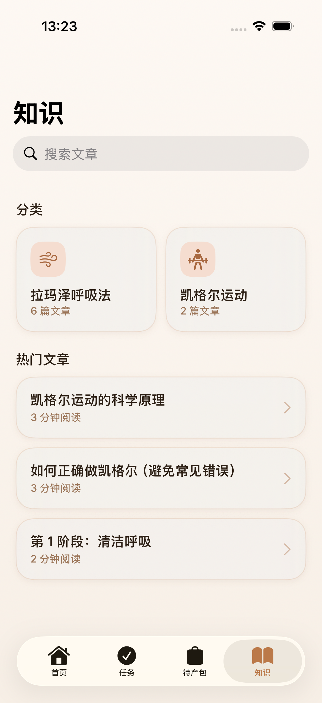 |
| ② 首页 |  |
| ③ 任务 Tab |  |
| ④ 待产包 Tab |  |
| ⑤ 知识 Tab |  |
| ⑥ 文章详情 | 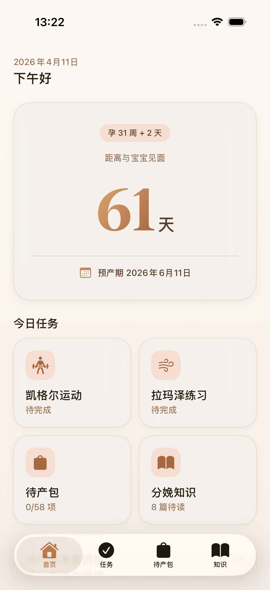 |
| ⑦ 凯格尔 |  |
| ⑧ 拉玛泽 | 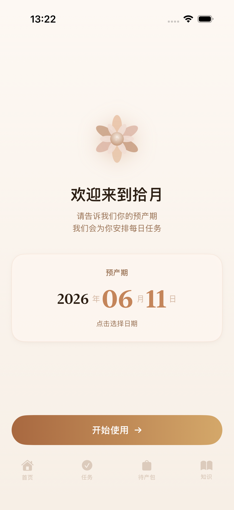 |
| ⑨ 最终状态 |  |

---

## 2. 待产包勾选/取消（testHospitalBagCheckUncheck ✅ 62s）

| 操作 | 状态 | 截图 |
|------|------|------|
| 勾选前 | 0/58 (0%) |  |
| 勾选后 | 1/58 (1%) | 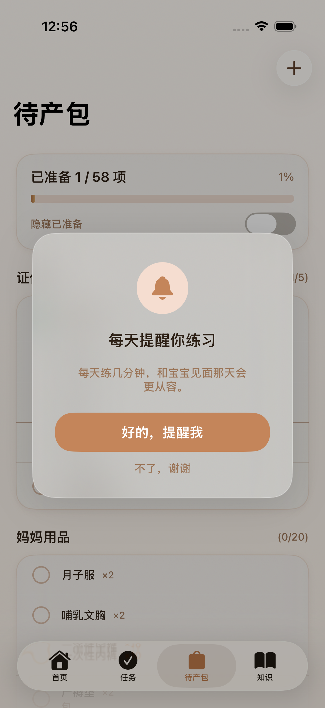 |
| 取消勾选 | 0/58 (0%) | 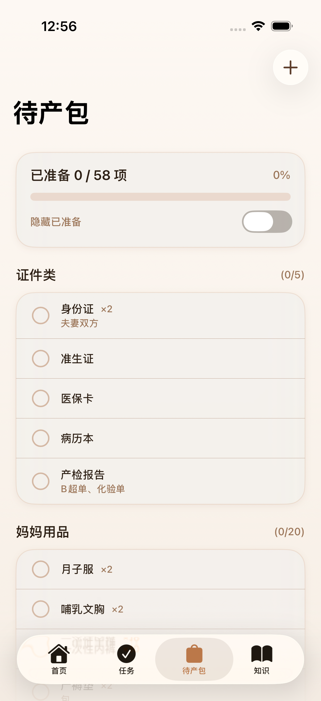 |

---

## 3. 文章收藏（testArticleFavorite ✅ 74s）

| 操作 | 状态 | 截图 |
|------|------|------|
| 收藏前 | ♡ 空心 | 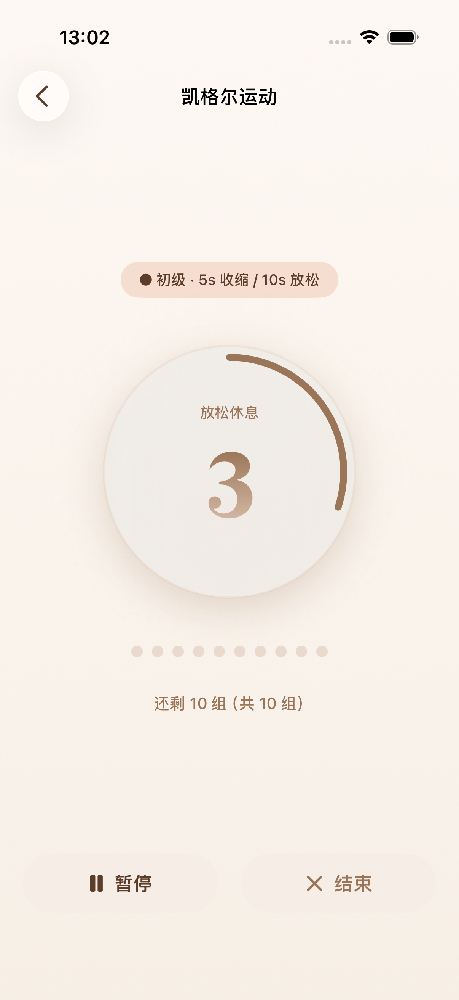 |
| 收藏后 | ♥ 实心 |  |
| 取消收藏 | ♡ 空心 | 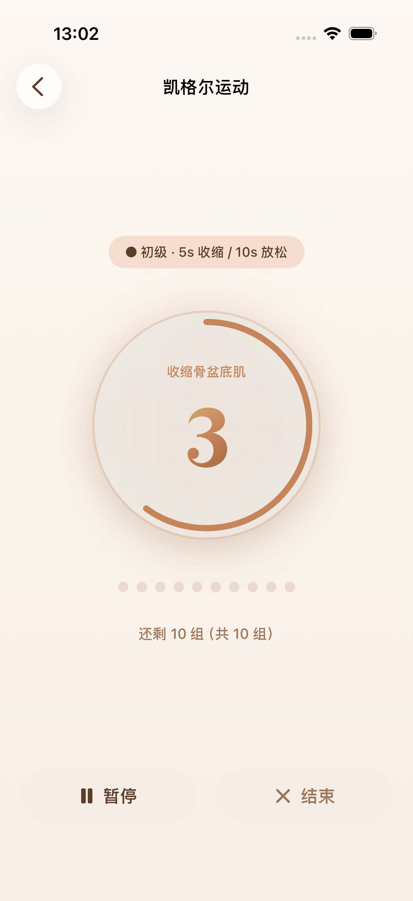 |

---

## 4. 凯格尔练习（testKegelExerciseFlow ✅ 80s）

| 操作 | 状态 | 截图 |
|------|------|------|
| 点击开始 | 进入计时器 | 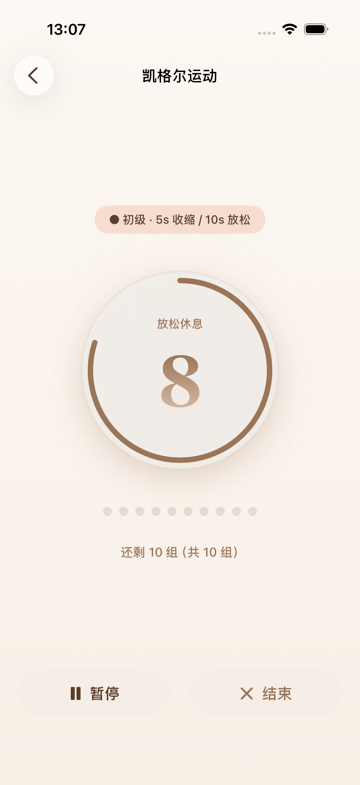 |
| 收缩阶段 | 倒计时中 | 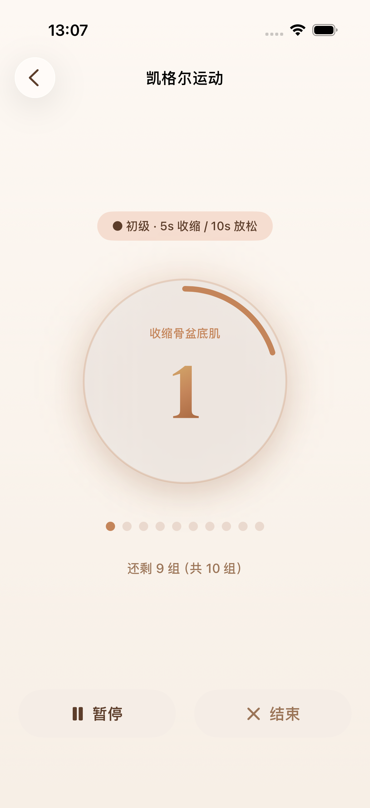 |
| 放松阶段 | 自动切换 |  |
| 结束返回 | 回到任务 | 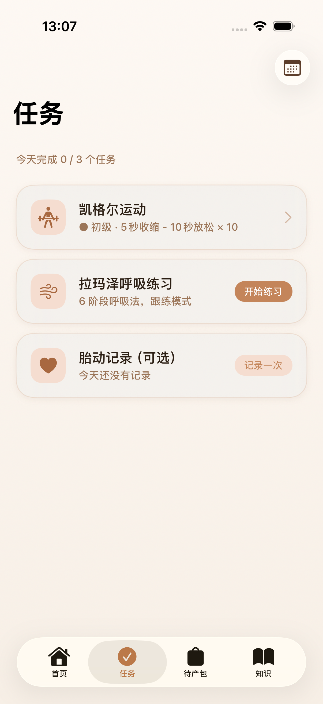 |

---

## 5. 胎动记录（testFetalMovementRecording ✅ 87s）

| 操作 | 状态 | 截图 |
|------|------|------|
| 打开记录 | 计数 0 | 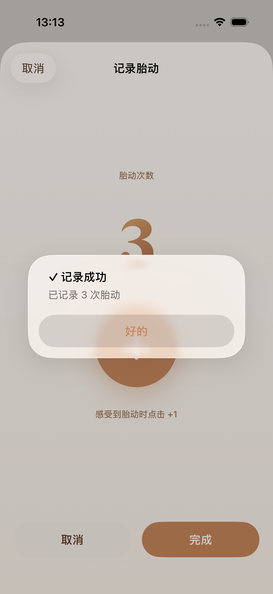 |
| +1 三次 | 计数 3 |  |
| 保存 | 成功提示 | 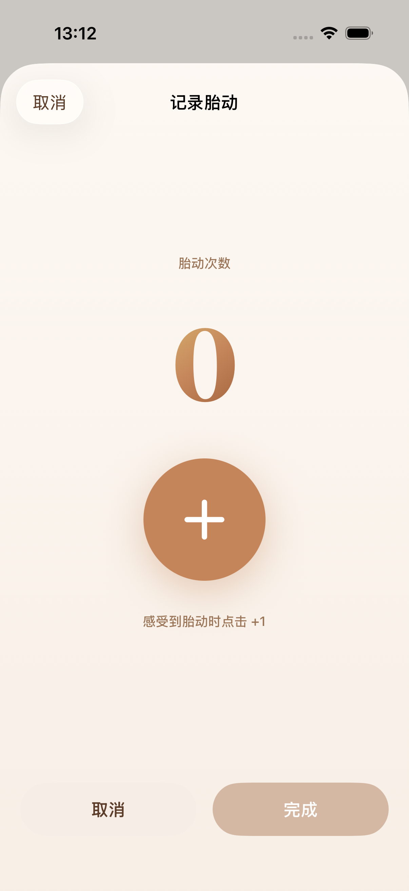 |
| 关闭 | 回到任务 |  |

---

## 6. 拉玛泽学习（testLamazeLearningMode ✅ 70s）

| 操作 | 状态 | 截图 |
|------|------|------|
| 拉玛泽入口 | 三种模式 | 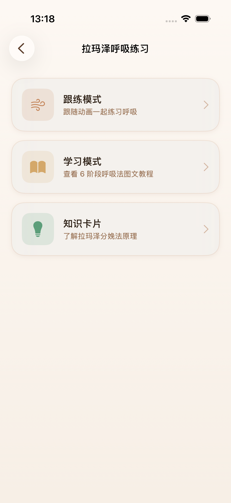 |
| 学习模式 | 6 阶段列表 | 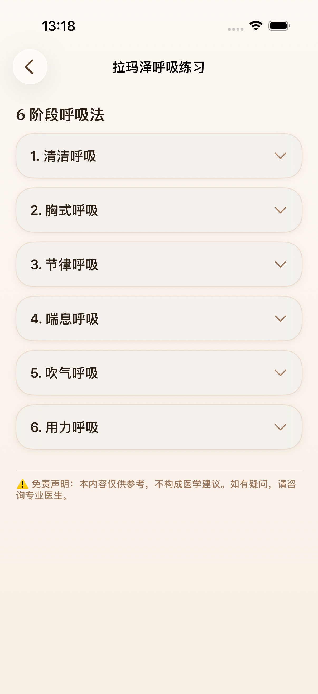 |

---

## 7. 其他通过的测试

| 测试 | 时间 | 验证内容 |
|------|------|----------|
| testCountdownCardExists ✅ | 28s | 首页有「距离与宝宝见面」+「天」+「预产期」 |
| testDueDateToday ✅ | 29s | 预产期设为今天不崩溃 |
| testHospitalBagAddItem ✅ | 35s | 待产包添加自定义物品成功 |
| testArticleStartExercise ✅ | 71s | 文章跟练按钮跳转到练习页 |
| testTabNavigationSmoke ✅ | 15s | 4 个 Tab 都能正常渲染 |
| testNotificationPreRequestPopup ✅ | 21s | 通知预请求弹窗显示 + 「不了，谢谢」关闭 |

---

## 8. 推送通知（#8 — 待真机验证）

| # | 验收项 | 结果 |
|---|--------|------|
| 1 | 首次完成任务后弹出预请求弹窗 | ✅ |
| 2 | 弹窗有「好的，提醒我」和「不了，谢谢」 | ✅ |
| 3 | 点「好的，提醒我」→ 系统权限弹窗 | ⏳ 需真机 |
| 4 | 点「不了，谢谢」→ 弹窗关闭 | ✅ |
| 5-8 | 17:00 智能推送逻辑 | ⏳ 需真机 |
| 9 | 拒绝权限后不推送 | ⏳ 需真机 |
| 10 | 预产期过后停止 | ⏳ 需真机 |
| 11 | App 被杀掉后触发 | ⏳ 需真机 |
| 12-13 | 7 天回归提醒 | ⏳ 需真机 |

---

## 验收结论

| 指标 | 结果 |
|------|------|
| XCUITest 用例 | **12/12 全绿** ✅ |
| 用户 flow 截图 | **25 张**（6 个 flow，每个有操作前→操作后） |
| 已关闭 issues | #4 #5 #6 #7 #9 #10 #11 #12 #13 #14 #15 #16 #17 #18 |
| 剩余 open issues | **#8**（推送通知 9 项需真机） |
| P0 bug | **0** |
| 通过标准 | ✅ **达标**（≥90% 通过，无 P0） |
