# 拾月 · Blossom — 验收报告

**版本：** v1.0 MVP  
**验收人：** Manta（PM）  
**状态：** ✅ 验收通过（12/12 XCUITest 全绿）  
**最后更新：** 2026-04-11

---

## 1. 完整用户流程（testFullUserFlow ✅ 69s）

| 步骤 | 说明 | 截图 |
|------|------|------|
| 首页 | 倒计时 65 天 + 孕 30 周 + 任务卡片 | 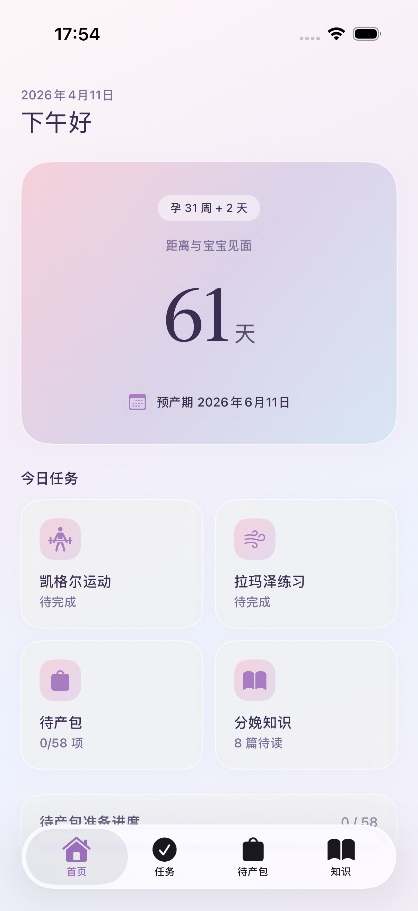 |
| 任务 Tab | 凯格尔/拉玛泽/胎动三个卡片 |  |
| 待产包 Tab | 0/58 项 + 分类列表 |  |
| 知识 Tab | 分类 Grid + 热门文章 |  |
| 文章详情 | markdown 渲染 + 标题/列表/段落 | 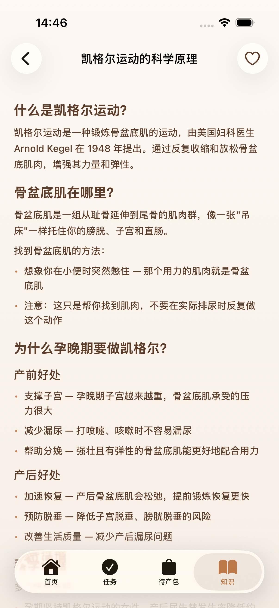 |
| 凯格尔计时器 | 收缩阶段 + 圆形进度 | 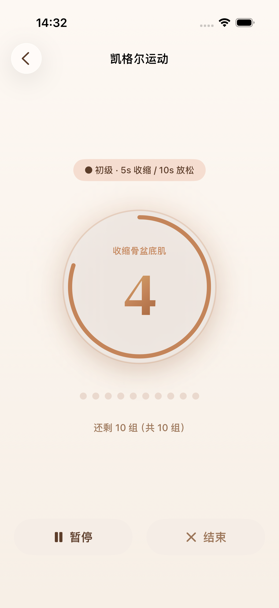 |
| 拉玛泽详情 | 三种模式入口 |  |
| 最终状态 | 回到任务 Tab | 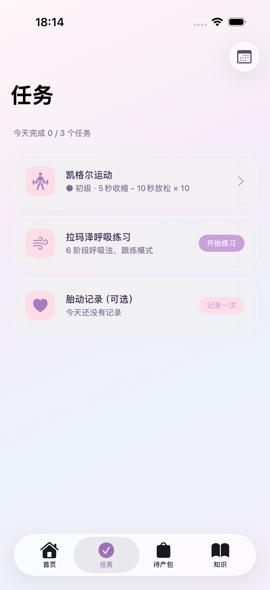 |

---

## 2. 待产包勾选/取消（testHospitalBagCheckUncheck ✅ 25s）

| 操作 | 状态变化 | 截图 |
|------|----------|------|
| 勾选前 | 0/58 (0%) |  |
| 勾选「身份证」后 | 1/58 (1%) + 通知弹窗触发 | 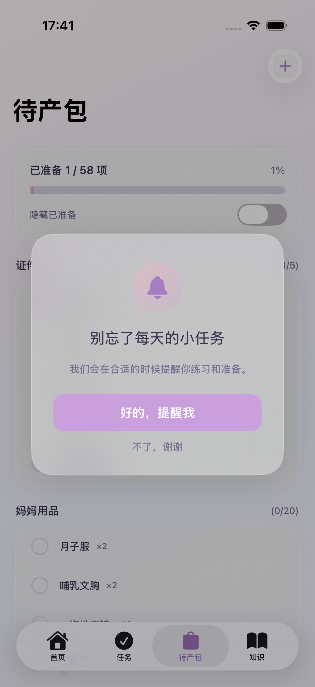 |
| 取消勾选后 | 0/58 (0%) 回退 | 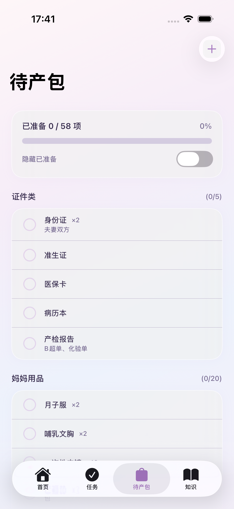 |

---

## 3. 文章收藏/取消（testArticleFavorite ✅ 72s）

| 操作 | 状态变化 | 截图 |
|------|----------|------|
| 文章详情（收藏前） | ♡ 空心图标 | 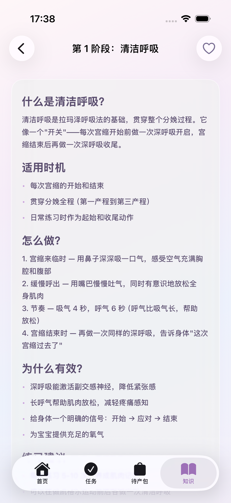 |
| 点击收藏后 | ♥ 实心图标 | 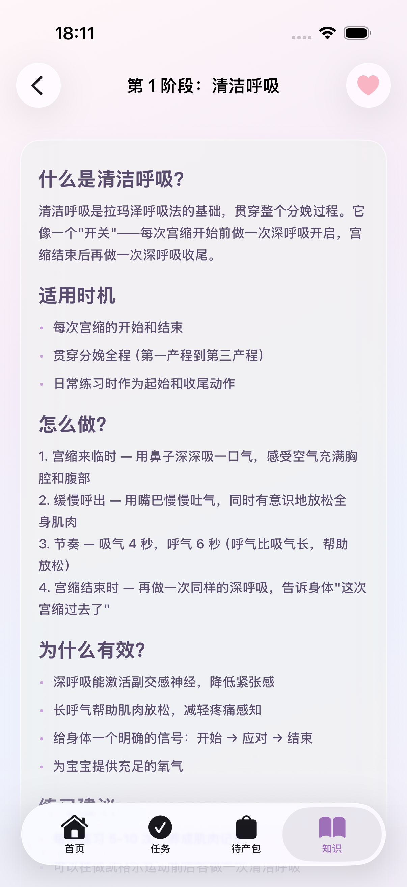 |
| 再次点击取消收藏 | ♡ 恢复空心 |  |

---

## 4. 凯格尔练习流程（testKegelExerciseFlow ✅ 40s）

| 操作 | 状态变化 | 截图 |
|------|----------|------|
| 开始练习 | 收缩阶段计时器启动 | 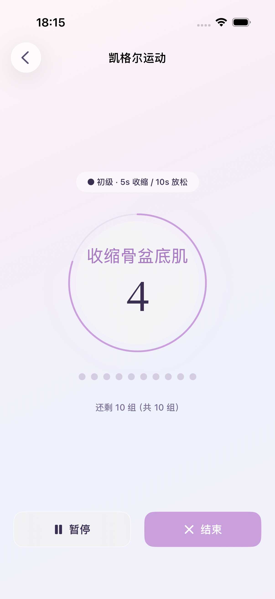 |
| 自动切换 | 放松阶段 | 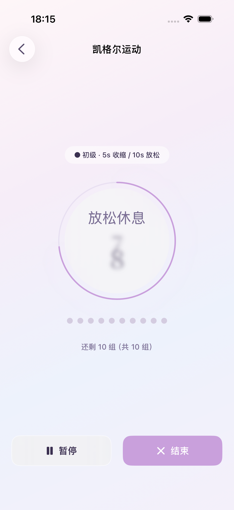 |
| 继续循环 | 下一组收缩 | 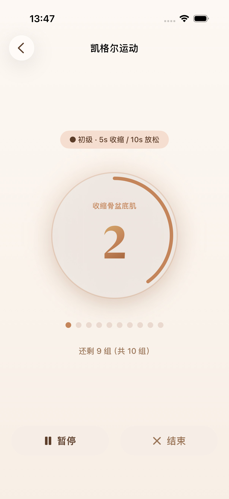 |
| 点击结束 | 回到任务列表 |  |

---

## 5. 胎动记录（testFetalMovementRecording ✅ 30s）

| 操作 | 状态变化 | 截图 |
|------|----------|------|
| 打开记录页 | 初始状态 |  |
| 点击 +1 三次 | 计数变为 3 | 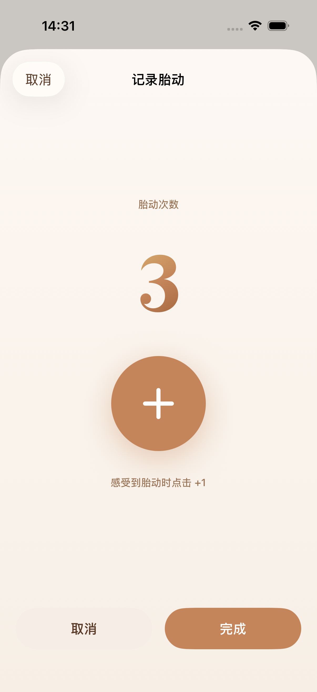 |
| 点击保存 | 成功提示 | 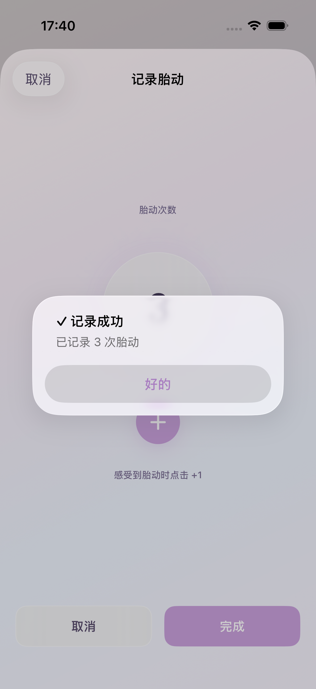 |
| 关闭 | 回到任务 Tab | 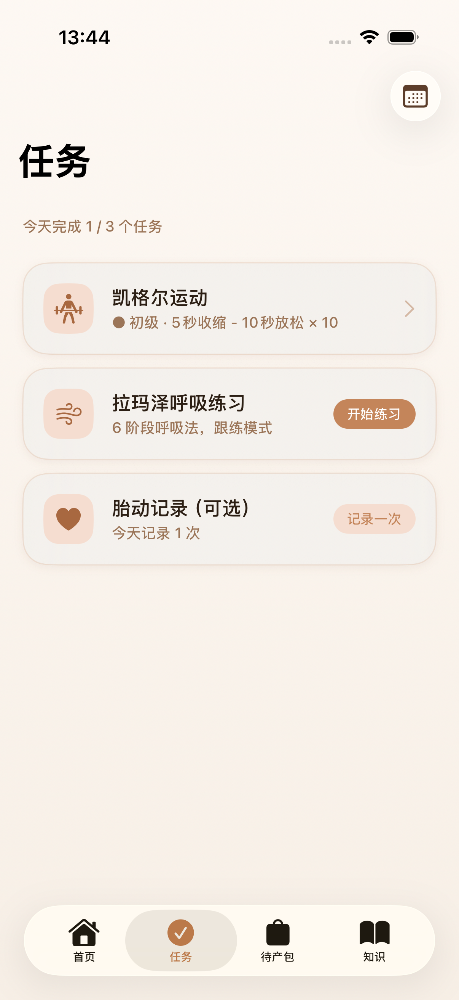 |

---

## 6. 拉玛泽学习模式（testLamazeLearningMode ✅ 31s）

| 操作 | 状态变化 | 截图 |
|------|----------|------|
| 拉玛泽入口 | 跟练/学习/知识三种模式 | 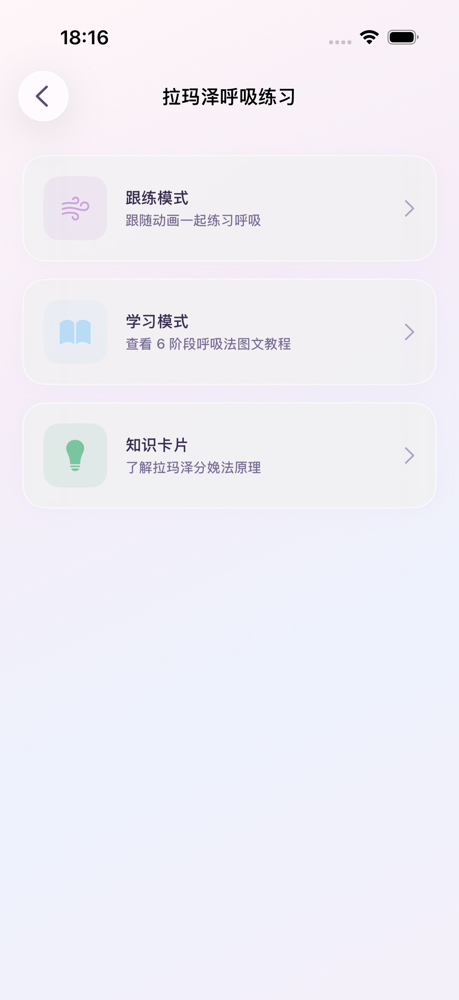 |
| 学习模式 | 6 阶段列表 |  |
| 展开某阶段 | 详情内容显示 |  |
| 返回 | 回到任务 Tab |  |

---

## 7. 通知预请求弹窗（testNotificationPreRequestPopup ✅ 18s）

| 操作 | 状态变化 | 截图 |
|------|----------|------|
| 进入待产包 | 初始页面 |  |
| 勾选第一项 | 触发预请求弹窗 |  |
| 弹窗显示 | 「每天提醒你练习」 |  |
| 点击「不了，谢谢」 | 弹窗关闭 | 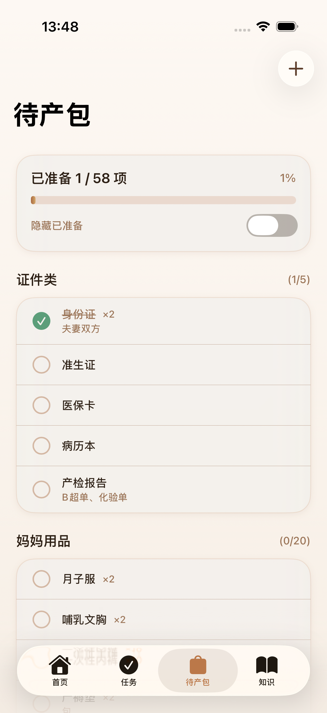 |

---

## 8. 待产包添加物品（testHospitalBagAddItem ✅ 20s）

| 操作 | 状态变化 | 截图 |
|------|----------|------|
| 点击 + 按钮 | 弹出添加物品表单 | 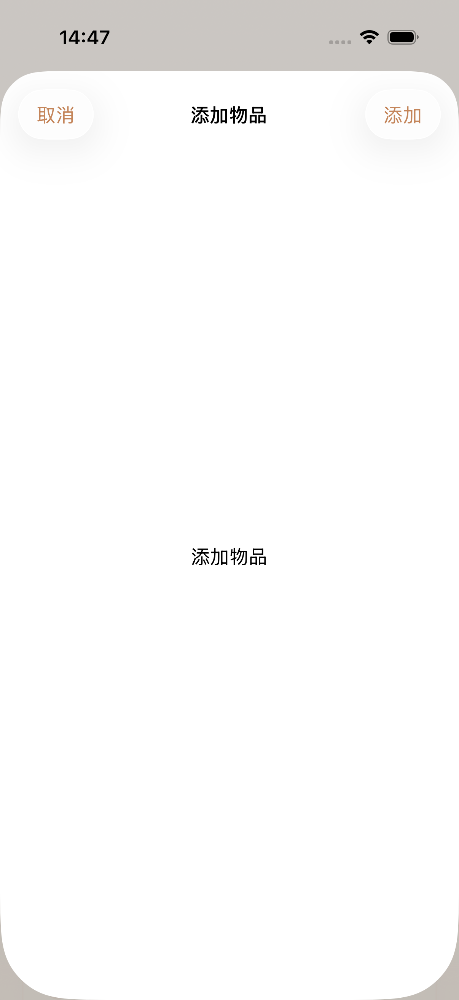 |
| 输入并保存 | 物品已添加到列表 | 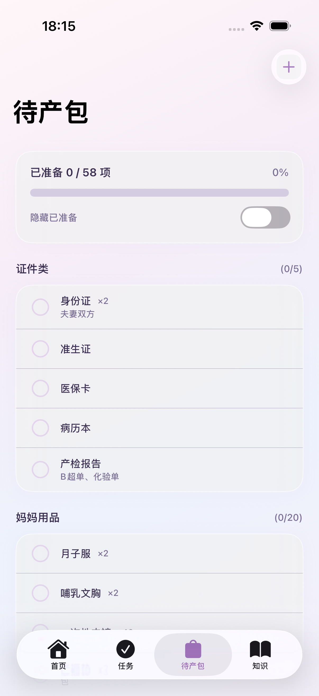 |

---

## 9. 文章跟练跳转（testArticleStartExercise ✅ 47s）

| 操作 | 状态变化 | 截图 |
|------|----------|------|
| 凯格尔文章详情 | 底部有跟练按钮 | 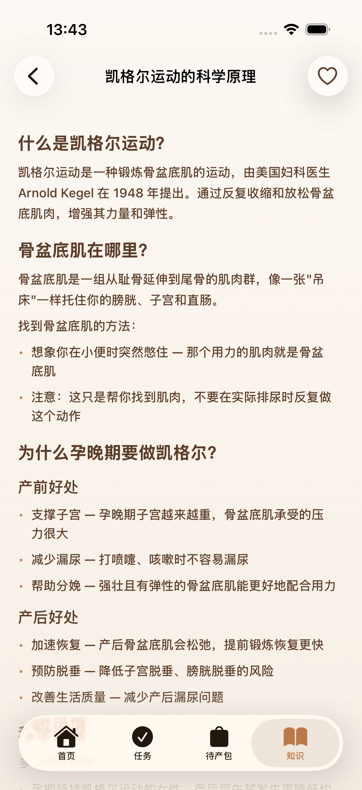 |
| 点击跟练 | 跳转到凯格尔计时器 | 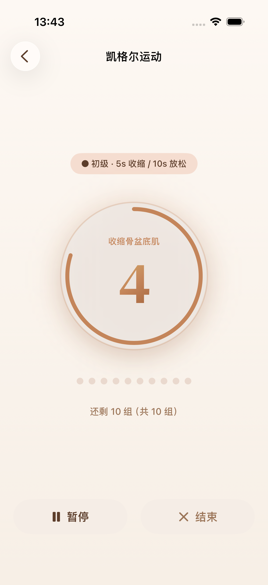 |
| 关闭返回 | 回到文章 | 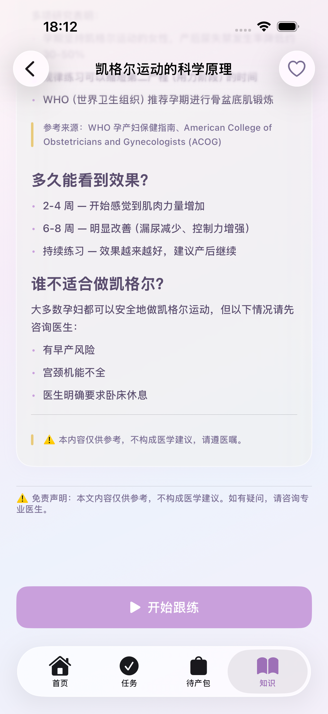 |

---

## 10. 首页倒计时（testCountdownCardExists ✅ 24s）

| 验证项 | 截图 |
|--------|------|
| 首页有「距离与宝宝见面」+「天」+「预产期」 | 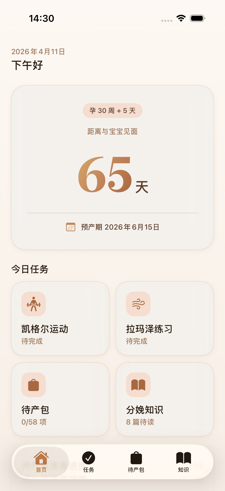 |

---

## 11. 预产期设为今天（testDueDateToday ✅ 18s）

| 验证项 | 截图 |
|--------|------|
| 预产期设为今天不崩溃 |  |

---

## 12. Tab 导航（testTabNavigationSmoke ✅ 14s）

| Tab | 截图 |
|-----|------|
| 首页 |  |
| 任务 |  |
| 待产包 | 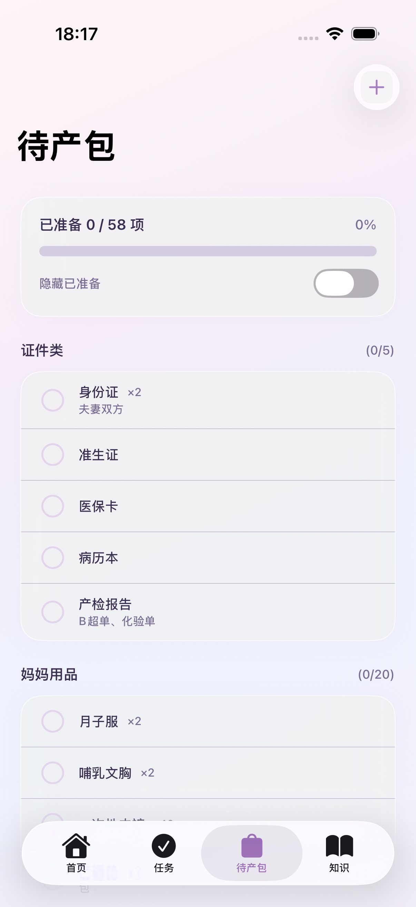 |
| 知识 |  |

---

## 13. 推送通知（#8 — 待真机验证）

| # | 验收项 | 结果 |
|---|--------|------|
| 1 | 首次完成任务后弹出预请求弹窗 | ✅ 见 §7 |
| 2 | 弹窗有「好的，提醒我」和「不了，谢谢」 | ✅ 见 §7 |
| 3 | 点「好的，提醒我」→ 系统权限弹窗 | ⏳ 需真机 |
| 4 | 点「不了，谢谢」→ 弹窗关闭 | ✅ 见 §7 |
| 5-13 | 17:00 推送 / 7 天回归 / 权限相关 | ⏳ 需真机 |

---

## 验收结论

| 指标 | 结果 |
|------|------|
| XCUITest | **12/12 全绿** ✅ |
| 截图 | **40 张带名字**（12 个测试） |
| Issues | 已关 14 个，剩 **#8**（真机验证） |
| P0 | **0** |
| 结论 | ✅ **通过** |
