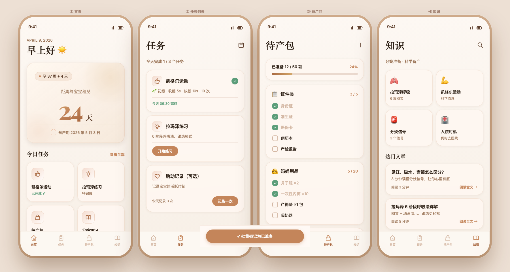
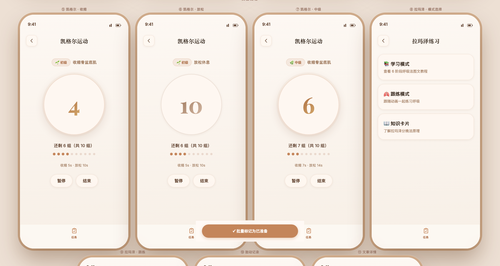
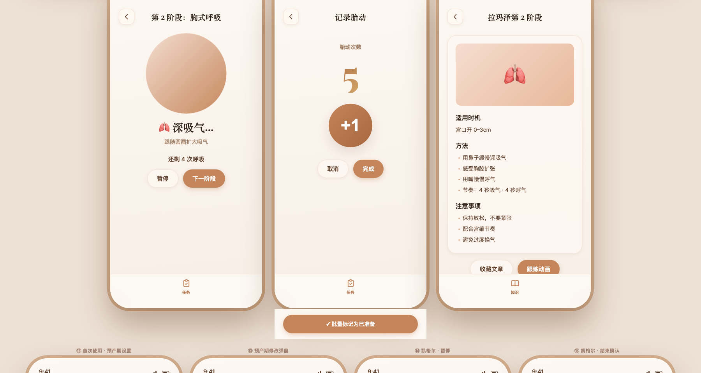

# Blossom（如期）

> 首个专为孕晚期（28-40周）设计的倒计时 + 任务助手

---

## 设计预览

### 主页面（4 个 Tab）

### 交互流程（凯格尔 / 拉玛泽 / 胎动 / 文章）

### 弹窗 / 状态 / 分支（首次引导 / 修改预产期 / 暂停 / Toast / 搜索 / 通知）

> 完整 23 屏交互设计稿：[design.html](./design.html)（浏览器打开即可预览）

---

## 产品简介

**如期 · Blossom** 是一款专为孕晚期准妈妈设计的 iOS App。

不做全孕期管理，只专注孕晚期最后 3 个月：
- 🗓 每天打开看倒计时，感受宝宝即将到来的期待
- 💪 凯格尔运动计时器（3 级进阶，自动升级）
- 🫁 拉玛泽呼吸法跟练动画（6 阶段）
- 🎒 待产包 Checklist（50 项全量清单）
- 📖 分娩知识卡片（21 篇科学内容）

**商业模式：** 买断制 ¥18，无订阅 / 无广告 / 无内购

---

## 文件说明

### 📄 产品文档

| 文件 | 说明 |
|------|------|
| [PRD-v2.0.md](./PRD-v2.0.md) | 完整产品需求文档（功能 / User Journey / 数据结构 / 技术架构） |
| [USER-FLOW.md](./USER-FLOW.md) | 完整用户流程（所有交互 / 跨 Tab 跳转 / 边界处理） |
| [DESIGN-SPEC.md](./DESIGN-SPEC.md) | 设计规范（配色 / 字体 / 组件 / 动效 / 无障碍） |
| [REVIEW-CHECKLIST.md](./REVIEW-CHECKLIST.md) | PRD & Design Review 准备（16 个常见 challenge 的回答） |

### 🎨 设计稿（HTML 原型）

| 文件 | 说明 | 预览 |
|------|------|------|
| [design.html](./design.html) | **完整设计稿（23 屏）** | [预览图1](./preview-1-main-tabs.png) [预览图2](./preview-2-interactions.png) [预览图3](./preview-3-modals.png) |
| [
| [app-icon.html](./app-icon.html) | App Icon 设计（花朵 · 玫瑰金配色） | [预览图](./app-icon-preview.png) |

---

## 核心设计系统

**配色：** 暖米白底 + 琥珀玫瑰金主色 + 杏粉点缀  
**字体：** Playfair Display（标题 / 数字） + Inter（正文）  
**风格：** Glassmorphism + Soft UI，参考 Headspace / Calm / Flo

---

## MVP 开发计划（3 周）

| 周次 | 目标 |
|------|------|
| Week 1（04/08–04/14） | 倒计时首页 + 孕周计算 + 4 Tab 框架 + 数据模型 |
| Week 2（04/15–04/21） | 凯格尔计时器 + 拉玛泽动画 + 待产包 Checklist + 本地存储 |
| Week 3（04/22–04/28） | 知识文章 + 推送通知 + UI 打磨 + TestFlight |

---

## 技术栈

- **框架：** SwiftUI（iOS 16+）
- **数据：** SwiftData（本地）
- **通知：** UserNotifications（本地推送）
- **未来：** iCloud 同步（v1.2）

---

*产品经理：Manta · 2026-04-09*
