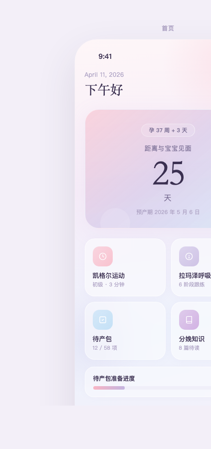
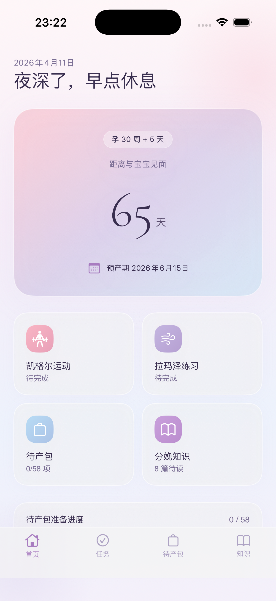
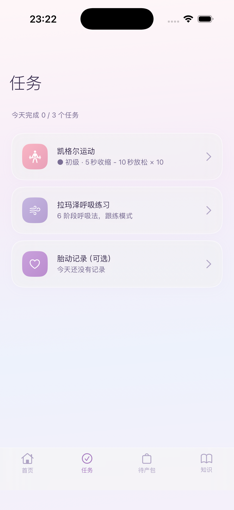
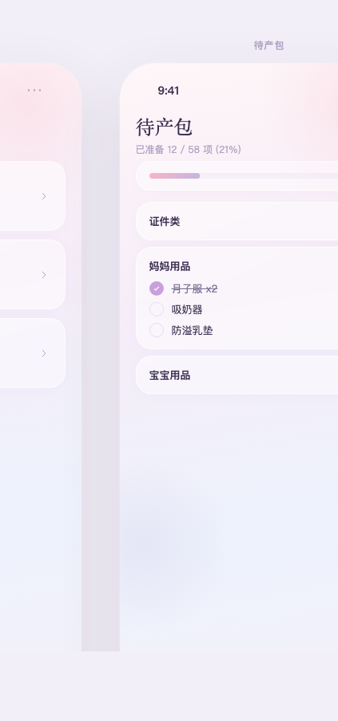
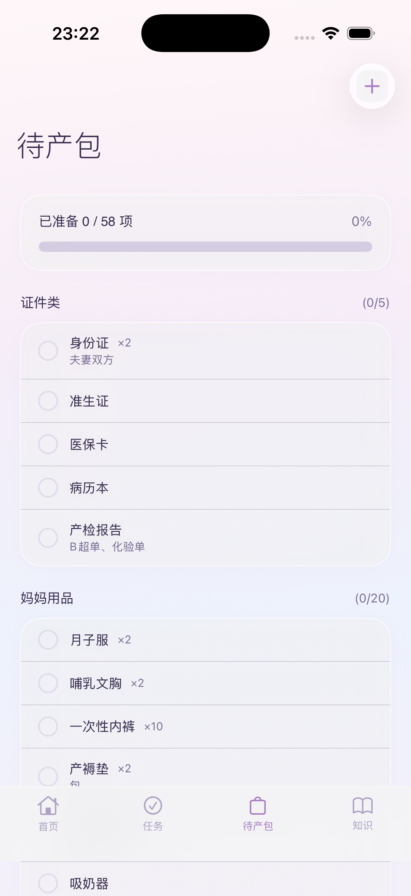
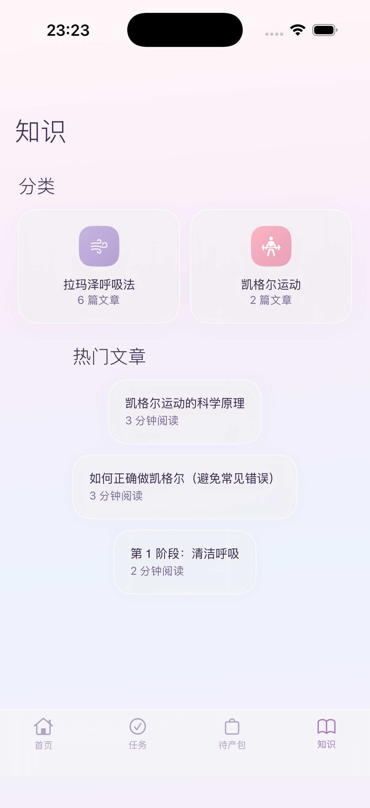
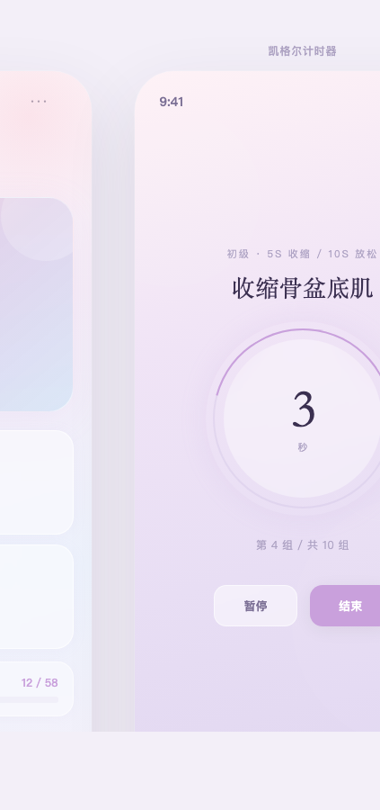
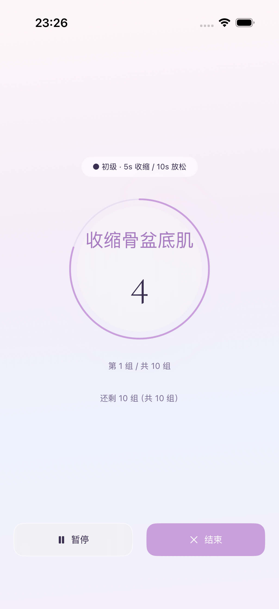
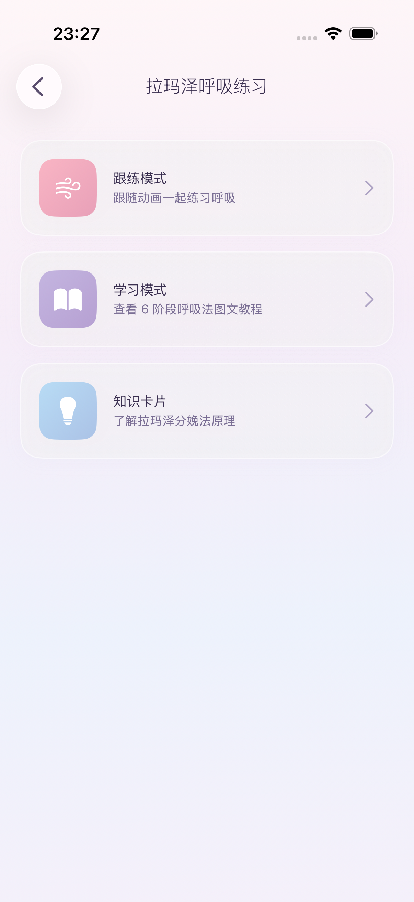

# 6 屏两列对比验收报告

**代码版本：** main `ff5cb6d`（clean build, DerivedData 已删除）  
**日期：** 2026-04-12

---

## 1. 首页

| Design | 实现 |
|--------|------|
|  |  |

| 元素 | 匹配？ |
|------|--------|
| 背景粉紫蓝渐变 | ✅ |
| 装饰光晕 | ✅ |
| 倒计时卡片半透明渐变 | ✅ |
| 倒计时数字衬线体 | ✅ |
| icon 白色内容 | ✅ |
| icon 彩色背景 | ✅ |
| 毛玻璃卡片 | ✅ |
| 自定义 Tab Bar | ✅ |
| 进度条渐变 | ✅ |
| 中文标题 | ⚠️ 系统字体（CG 不含中文） |

## 2. 任务页

| Design | 实现 |
|--------|------|
|  |  |

| 元素 | 匹配？ |
|------|--------|
| icon 白色+彩色背景 | ✅ |
| `>` 箭头导航 | ✅ |
| 毛玻璃卡片 | ✅ |
| Tab Bar 无圆底 | ✅ |
| 中文标题 | ⚠️ 系统字体 |

## 3. 待产包

| Design | 实现 |
|--------|------|
|  |  |

| 元素 | 匹配？ |
|------|--------|
| 进度条粉紫渐变 | ✅ |
| 0/58 项 | ✅ |
| 未勾选紫色圆圈 | ✅ |
| + 添加按钮 | ✅ |
| 分类标题 | ✅ |
| Tab Bar | ✅ |
| 中文标题 | ⚠️ 系统字体 |

## 4. 知识页

| Design | 实现 |
|--------|------|
|  |  |

| 元素 | 匹配？ |
|------|--------|
| 分类卡片毛玻璃 | ✅ |
| 分类 icon 颜色区分 | ✅ |
| icon 白色内容 | ✅ |
| 热门文章列表 | ✅ |
| Tab Bar | ✅ |
| 中文标题 | ⚠️ 系统字体 |

## 5. 凯格尔

| Design | 实现 |
|--------|------|
|  |  |

| 元素 | 匹配？ |
|------|--------|
| 浅紫渐变背景 | ✅ |
| 深色文字 | ✅ |
| 紫色细线圆环 | ✅ |
| 圆环 glow | ✅ |
| 大号纤细数字 | ✅ |
| 文字组数指示器 | ✅ |
| 暂停/结束按钮 | ✅ |
| 全屏无导航栏 | ✅ |

## 6. 拉玛泽

| Design | 实现 |
|--------|------|
|  |  |

| 元素 | 匹配？ |
|------|--------|
| 三种模式卡片 | ✅ |
| icon 彩色背景 | ✅ |
| icon 白色内容 | ✅ |
| `>` 箭头 | ✅ |
| Tab Bar | ✅ |

---

## 总结

| 分类 | ✅ | ⚠️ |
|------|----|----|
| 首页 | 9 | 1 |
| 任务 | 4 | 1 |
| 待产包 | 6 | 1 |
| 知识 | 5 | 1 |
| 凯格尔 | 8 | 0 |
| 拉玛泽 | 5 | 0 |
| **总计** | **37** | **4** |

4 个 ⚠️ 全部是中文标题 Cormorant Garamond 不含中文字形 → fallback 系统字体。
0 个 ❌。
